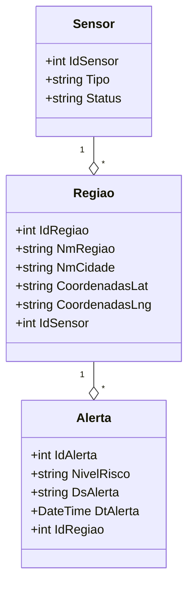

# AquaGuard ‒ API RESTful (.NET 8 + Oracle)

Este repositório contém a API RESTful do **AquaGuard**, conforme os requisitos de Advanced Business Development with .NET (Global Solution 2025/1). A API foi desenvolvida em .NET 8, usa Entity Framework Core com Oracle como banco de dados e está documentada com Swagger.

---

## 📋 Sumário

- [AquaGuard ‒ API RESTful (.NET 8 + Oracle)](#aquaguard--api-restful-net-8--oracle)
  - [📋 Sumário](#-sumário)
  - [👥 Integrantes](#-integrantes)
  - [📦 Pré-requisitos](#-pré-requisitos)
  - [🔧 Configurar a string de conexão](#-configurar-a-string-de-conexão)
  - [🛠️ Migrations e atualização do banco](#️-migrations-e-atualização-do-banco)
- [Como funciona a geração de IDs (sequence + trigger)](#como-funciona-a-geração-de-ids-sequence--trigger)
  - [🔗 Estrutura de pastas resumida](#-estrutura-de-pastas-resumida)
  - [🖼️ Diagrama](#diagrama)  
  - [🎥 Vídeo de demonstração e Pitch](#-vídeo-de-demonstração-e-pitch)

---

## 👥 Integrantes

- **RM 554983** – Raphaela Oliveira Tatto  
- **RM 558021** – Tiago Ribeiro Capela  

---

## 📦 Pré-requisitos

- [.NET 8 SDK](https://dotnet.microsoft.com/en-us/download/dotnet/8.0) (ou superior) instalado localmente.  
- Acesso ao Oracle do FIAP (ou equivalente) com usuário/schema que contenha permissão para criar tabelas, sequences e triggers.  
- [SQL Developer](https://www.oracle.com/tools/downloads/sqldev-downloads.html) (ou similar) para checar tabelas e sequences.  

> **Importante:**  
> - Este projeto assume que você já criou as sequences e triggers conforme abaixo. Caso ainda não tenha feito, veja [Como funciona a geração de IDs](#como-funciona-a-geração-de-ids).  
> - A pasta `Migrations/` (gerada pelo EF Core) deve estar presente e sincronizada com o modelo atual.

---

## 🔧 Configurar a string de conexão

1. Abra o arquivo `Program.cs`.  
2. Localize o trecho:

   ```csharp
   builder.Services.AddDbContext<AquaGuardContext>(options =>
       options.UseOracle(
           "User Id=SEU_USUARIO;Password=SUA_SENHA;" +
           "Data Source=(DESCRIPTION=(ADDRESS=(PROTOCOL=TCP)(HOST=oracle.fiap.com.br)(PORT=1521))" +
           "(CONNECT_DATA=(SERVICE_NAME=ORCL)))"
       )
   );
   ```

3. Substitua:
   - `SEU_USUARIO` pelo seu usuário Oracle (ex.: `rm554983`).  
   - `SUA_SENHA` pela senha correspondente.  
   - Caso o host ou serviço sejam diferentes, ajuste `HOST=...`, `PORT=...` e `SERVICE_NAME=...` conforme seu ambiente.

4. Salve `Program.cs`.

---

## 🛠️ Migrations e atualização do banco

> **Observação:** **SEMPRE** apague as tabelas antigas (se clausuradas) antes de aplicar a migration. Caso contrário, a migration pode falhar com `ORA-00955` (“nome já está sendo usado”).

1. Abra o **SQL Developer** e conecte-se ao seu schema (por exemplo, `RM554983`).  
2. Execute estes blocos PL/SQL para remover tabelas, triggers e sequences antigas:

   ```sql
   BEGIN
     EXECUTE IMMEDIATE 'DROP TABLE TB_AQUA_ALERTA CASCADE CONSTRAINTS';
   EXCEPTION
     WHEN OTHERS THEN
       IF SQLCODE != -942 THEN
         RAISE;
       END IF;
   END;
   /

   BEGIN
     EXECUTE IMMEDIATE 'DROP TABLE TB_AQUA_REGIAO CASCADE CONSTRAINTS';
   EXCEPTION
     WHEN OTHERS THEN
       IF SQLCODE != -942 THEN
         RAISE;
       END IF;
   END;
   /

   BEGIN
     EXECUTE IMMEDIATE 'DROP TABLE TB_AQUA_SENSOR CASCADE CONSTRAINTS';
   EXCEPTION
     WHEN OTHERS THEN
       IF SQLCODE != -942 THEN
         RAISE;
       END IF;
   END;
   /

   BEGIN
     EXECUTE IMMEDIATE 'DROP TRIGGER trg_tb_aqua_alerta_pk';
   EXCEPTION WHEN OTHERS THEN
     IF SQLCODE != -4080 THEN  -- ORA-04080: trigger does not exist
       RAISE; 
     END IF;
   END;
   /

   BEGIN
     EXECUTE IMMEDIATE 'DROP SEQUENCE seq_tb_aqua_alerta';
   EXCEPTION WHEN OTHERS THEN
     IF SQLCODE != -2289 THEN  -- ORA-02289: sequence does not exist
       RAISE;
     END IF;
   END;
   /

   BEGIN
     EXECUTE IMMEDIATE 'DROP TRIGGER trg_tb_aqua_regiao_pk';
   EXCEPTION WHEN OTHERS THEN
     IF SQLCODE != -4080 THEN
       RAISE;
     END IF;
   END;
   /

   BEGIN
     EXECUTE IMMEDIATE 'DROP SEQUENCE seq_tb_aqua_regiao';
   EXCEPTION WHEN OTHERS THEN
     IF SQLCODE != -2289 THEN
       RAISE;
     END IF;
   END;
   /

   BEGIN
     EXECUTE IMMEDIATE 'DROP TRIGGER trg_tb_aqua_sensor_pk';
   EXCEPTION WHEN OTHERS THEN
     IF SQLCODE != -4080 THEN
       RAISE;
     END IF;
   END;
   /

   BEGIN
     EXECUTE IMMEDIATE 'DROP SEQUENCE seq_tb_aqua_sensor';
   EXCEPTION WHEN OTHERS THEN
     IF SQLCODE != -2289 THEN
       RAISE;
     END IF;
   END;
   /
   ```

3. (Opcional) Remova o histórico de migrations aplicadas:

   ```sql
   DELETE FROM "__EFMigrationsHistory";
   COMMIT;
   ```

4. No terminal, dentro da pasta que contém o arquivo `.csproj`, rode:

   ```bash
   dotnet ef migrations remove
   ```

   Isso apagará a última migration (caso exista). Se houver mais de uma, execute quantas vezes forem necessárias até a pasta `Migrations/` ficar vazia.

5. Gere uma nova migration “limpa” a partir dos Models atuais:

   ```bash
   dotnet ef migrations add InitialCreate
   ```

6. Aplique essa migration ao banco Oracle:

   ```bash
   dotnet ef database update
   ```
   Se tudo estiver correto, o EF Core criará as tabelas:
   - `TB_AQUA_SENSOR`  
   - `TB_AQUA_REGIAO`  
   - `TB_AQUA_ALERTA`  

   e registrará “InitialCreate” em `__EFMigrationsHistory`.

7. Rodar o projeto:
      ```bash
   dotnet run
   ```
---

# Como funciona a geração de IDs (sequence + trigger)

Cada tabela possui sequência e trigger que preenchem automaticamente o ID:
- **Sequência**: `seq_tb_aqua_sensor`, `seq_tb_aqua_regiao`, `seq_tb_aqua_alerta`.  
- **Trigger**: `trg_tb_aqua_sensor_pk`, `trg_tb_aqua_regiao_pk`, `trg_tb_aqua_alerta_pk`.  

Exemplo de trigger Oracle (para `TB_AQUA_SENSOR`):
```sql
CREATE OR REPLACE TRIGGER trg_tb_aqua_sensor_pk
BEFORE INSERT ON tb_aqua_sensor
FOR EACH ROW
BEGIN
  SELECT seq_tb_aqua_sensor.NEXTVAL
    INTO :NEW.id_sensor
    FROM dual;
END;
/
```
Idem para `TB_AQUA_REGIAO` e `TB_AQUA_ALERTA`.

---

## 🔗 Estrutura de pastas resumida

```
api-aquaguard-dotnet/
├── Controllers/
│   ├── SensorController.cs
│   ├── RegiaoController.cs
│   └── AlertaController.cs
├── Data/
│   └── AquaGuardContext.cs
├── DTOs/
│   ├── SensorDTO.cs
│   ├── SensorCreateDTO.cs
│   ├── RegiaoDTO.cs
│   ├── RegiaoCreateDTO.cs
│   ├── AlertaDTO.cs
│   └── AlertaCreateDTO.cs
├── Models/
│   ├── Sensor.cs
│   ├── Regiao.cs
│   └── Alerta.cs
├── Migrations/
│   └── ... (arquivos de migration)
├── Program.cs
└── README.md
```

## 🖼️ Diagrama

### Diagrama de Classes (UML)


---

## 🎥 Vídeo de demonstração e Pitch
- **Vídeo demonstração do projeto**: https://youtu.be/ocFv_mXoy0g 
- **Vídeo Pitch (máx. 3 minutos)**: [link do pitch]


